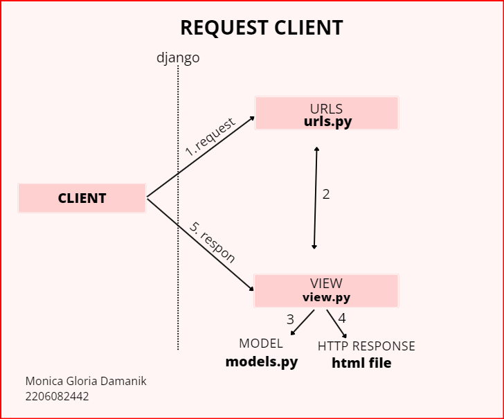
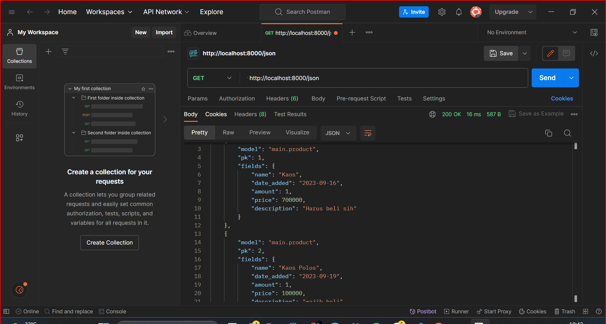
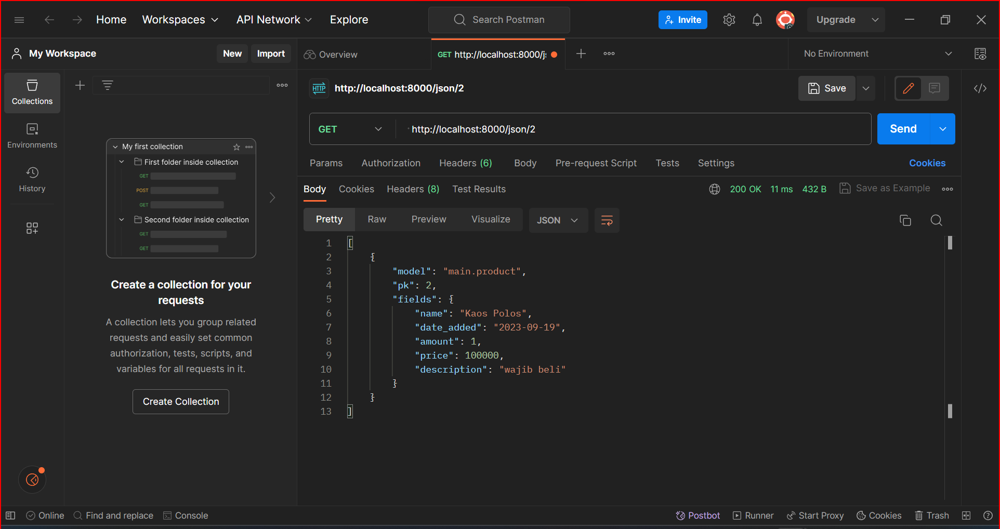
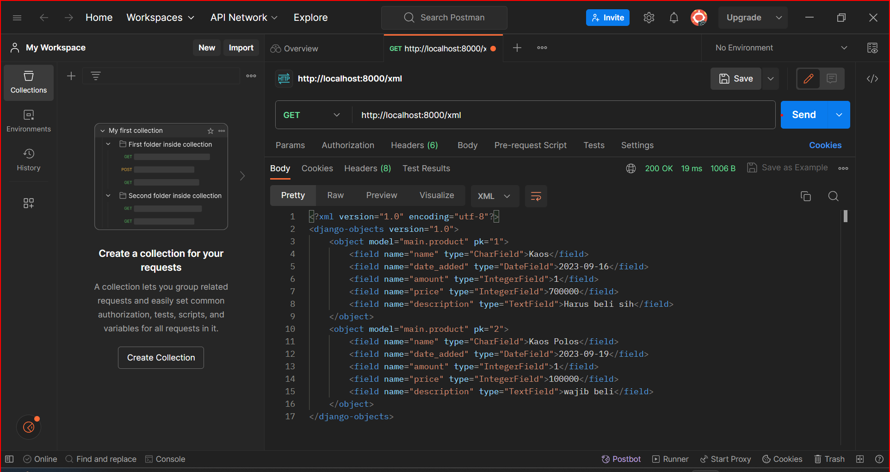
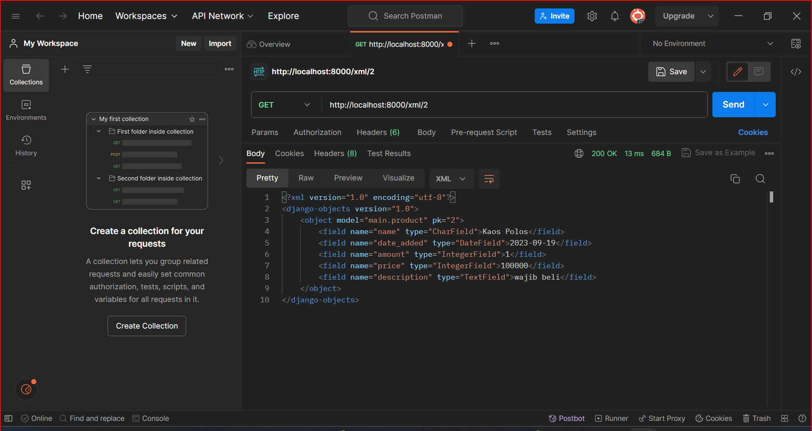
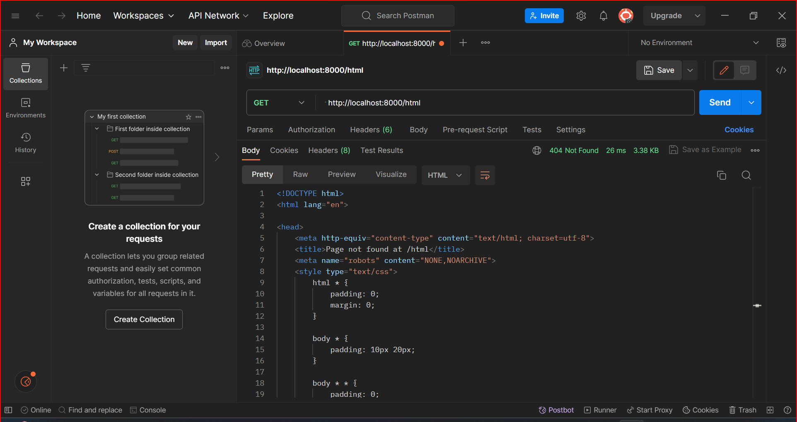

Nama    : Monica Gloria Damanik

NPM     : 2206082442

Kelas   : PBP B

Tautan Adaptable : https://inventory-monica.adaptable.app
Tautan Github    : https://github.com/monicaa37/my-project1.git

---------------------------------------------------TUGAS 2----------------------------------------------------
1. Jelaskan bagaimana cara kamu mengimplementasikan checklist di atas secara step-by-step.
   jawab : 

   **TAHAP 1 : MEMBUAT SEBUAT PROYEK DJANGO BARU**

      a. Membuat Direktori dan Mengaktifkan Virtual Environment
      - Pertama, buat direktori baru di lokasi yang Anda inginkan untuk proyek Anda. Anda dapat melakukannya melalui terminal atau dengan menggunakan file explorer. Setelah membuat direktori, masuk ke dalamnya dengan perintah cd.
      - Sekarang, Anda perlu membuat virtual environment di dalam direktori proyek Anda.
      - Gunakan perintah berikut untuk membuat venv. Perlu mengaktifkannya dengan perintah venv\Scripts\activate.
     
     b. Menyiapkan Dependencies dan Membuat Proyek Django
      - Di dalam direktori yang sama, buat berkas requirements.txt dan tambahkan beberapa dependencies.
      - Lalu, Pasang dependencies dengan perintah berikut. Jangan lupa jalankan virtual environment terlebih dahulu sebelum menjalankan perintah berikut: pip install -r requirements.txt
      - Kemudian, buat proyek Django sesuai yang diinginkan dengan perintah berikut: django-admin startproject (nama proyek) 
     
     c. Konfigurasi Proyek dan Menjalankan Server
      - Tambahkan tanda (*) pada ALLOWED_HOSTS di settings.py untuk keperluan deployment.
      - Jalankan server Django dengan perintah: python manage.py runserver.
      - Kemudian, nonaktifkan virtual environment dengan perintah: deactivate 

    **TAHAP 2 : MEMBUAT APLIKASI DENGAN NAMA MAIN PADA PROYEK TERSEBUT**

      - Pastikan Anda sudah berada dalam direktori proyek Django Anda.

      - Jalankan perintah berikut untuk membuat aplikasi "main": python manage.py startapp main .

      - Setelah membuat aplikasi "main," Anda perlu mendaftarkannya ke dalam proyek Anda.

      - Buka file nama_proyek/settings.py dan temukan variabel INSTALLED_APPS. Tambahkan nama aplikasi "main" ke dalam daftar aplikasi yang terdaftar.

2. Buatlah bagan yang berisi request client ke web aplikasi berbasis Django beserta responnya dan jelaskan pada bagan tersebut kaitan antara urls.py, views.py, models.py, dan berkas html.
jawab : 

3. Jelaskan mengapa kita menggunakan virtual environment? Apakah kita tetap dapat membuat aplikasi web berbasis Django tanpa menggunakan virtual environment?
jawab : Virtual environment ini berguna untuk mengisolasi package serta dependencies dari aplikasi sehingga tidak bertabrakan dengan versi lain yang ada pada komputermu. Untuk membuat aplikasi web, anda masih dapat membuat aplikasi web berbasis Django tanpa menggunakan virtual environment, tetapi tidak disarankan. 
   
4. Jelaskan apakah itu MVC, MVT, MVVM dan perbedaan dari ketiganya.
jawab : 
    a. Model View Controller atau yang dapat disingkat MVC adalah sebuah pola arsitektur dalam membuat sebuah aplikasi dengan cara memisahkan kode menjadi tiga bagian yang terdiri dari:
      * Model --> Bagian yang bertugas untuk menyiapkan, mengatur, memanipulasi, dan mengorganisasikan data yang ada di database.
      * View --> Bagian yang bertugas untuk menampilkan informasi dalam bentuk Graphical User Interface (GUI).
      * Controller --> Bagian yang bertugas untuk menghubungkan serta mengatur model dan view agar dapat saling terhubung.
        
   b. Model View Template
      * Model: Sama seperti dalam MVC, model mengurus data dan logika bisnis.
      * View: Bertanggung jawab untuk tampilan dan presentasi data, mirip dengan View dalam MVC.
      * Template: Template dalam MVT adalah elemen yang berbeda. Ini adalah bagian yang merender tampilan dalam aplikasi web         Django. Template menggantikan peran Controller dalam MVC, karena sebagian besar logika pengendalian berada dalam             framework Django itu sendiri.

   c. Model View - View Model adalah arsitektur yang digunakan dalam pengembangan aplikasi berbasis klien, khususnya dalam pengembangan aplikasi web menggunakan kerangka kerja JavaScript. 
    * Model: Ini adalah representasi data dan logika bisnis, sama seperti dalam MVC dan MVT.
    * View: Bertanggung jawab untuk tampilan dan presentasi data, mirip dengan View dalam MVC dan MVT.
    * ViewModel: Ini adalah komponen yang memisahkan Model dari View. ViewModel mengambil data dari Model dan mempersiapkannya untuk ditampilkan di View. ViewModel juga mengelola tindakan pengguna dan berfungsi sebagai penghubung antara Model dan View. 
    
      Perbedaan ketiganya adalah dalam bagaimana komponen-komponen ini berinteraksi dan siapa yang bertanggung jawab untuk apa. MVC dan MVT adalah konsep yang lebih tua dan sering digunakan dalam pengembangan aplikasi web dengan back-end yang kuat, sedangkan MVVM adalah pendekatan yang lebih modern untuk pengembangan aplikasi berbasis klien dengan fokus pada pemisahan antara tampilan dan logika bisnis.
   

------------------------------------------------------TUGAS 3---------------------------------------------------
1. Apa perbedaan antara form POST dan form GET dalam Django?
ans : 
- Method GET

a. Jangan gunakan GET bila kita ingin membuat form untuk data yang sensitif/ mempunyai privasi, misalnya username,password (karena akan tampil di URL)
b. Sebaliknya gunakan GET untuk data dengan informasi yang umum, seperti nama,email atau lainnya
c. Gunakan method GET untuk data yang relatif kecil

- Method POST

a. Gunakan method POST untuk jenis informasi data pribadi misalnya username dan password ,karena lebih aman dibandingkan method GET dan data tidak akan tampil di URL
b. Gunakan method POST untuk data yang relatif besar.

2. Apa perbedaan utama antara XML, JSON, dan HTML dalam konteks pengiriman data?
ans : 
- XML (eXtensible Markup Language): Digunakan untuk menyimpan dan mengirim data terstruktur dengan menggunakan tag pembuka dan penutup. Fleksibel dan kuat, cocok untuk data yang sangat terstruktur.

- JSON (JavaScript Object Notation): Digunakan untuk pertukaran data yang ringan, menggunakan sintaks objek dan array mirip JavaScript. Sederhana dan mudah dibaca, cocok untuk data sederhana.

- HTML (HyperText Markup Language): Bahasa markup untuk membuat tampilan halaman web. Digunakan untuk mendefinisikan struktur dan konten halaman web, bukan untuk pertukaran data.

3. Mengapa JSON sering digunakan dalam pertukaran data antara aplikasi web modern?

ans : 
JSON sering digunakan dalam aplikasi web modern karena ringan, mudah dibaca, mendukung berbagai struktur data, independen dari bahasa, efisien dalam penggunaan bandwidth, mendukung RESTful APIs, dan memiliki dukungan luas.

4. Jelaskan bagaimana cara kamu mengimplementasikan checklist di atas secara step-by-step

ans : 
- Membuat Input Form:

   a. Buat model objek yang ingin Anda tambahkan.
   b. Buat form Django untuk model tersebut di forms.py.

- Migrasi Database:

   a. Buat dan terapkan migrasi untuk mengaktifkan model di database dengan perintah makemigrations dan migrate.

- Membuat 5 Fungsi Views:

Buat views untuk:
   a. Menambahkan objek dengan form input.
   b. Melihat objek dalam format HTML.
   c. Melihat objek dalam format XML.
   d. Melihat objek dalam format JSON.
   e. Melihat objek berdasarkan ID dalam format XML dan JSON.

- Membuat Template HTML:

   a. Buat file HTML untuk tampilan objek dan form input.

- Mengatur URL Routing:

   a. Tentukan URL untuk setiap view di file urls.py aplikasi Anda.

Dengan langkah-langkah ini, Anda akan memiliki aplikasi Django yang memungkinkan pengguna untuk menambahkan objek dan melihatnya dalam berbagai format. Pastikan untuk menyesuaikan model, form, dan template sesuai kebutuhan aplikasi Anda.

hasil screenshot postman : 
1. json 

2. json id

3. xml 

4. xml id 

5. html 

----------------------------------------TUGAS4 --------------------------------------

1. Apa itu Django UserCreationForm, dan jelaskan apa kelebihan dan kekurangannya?

ans :  UserCreationForm adalah salah satu formulir yang disediakan oleh Django, yang digunakan untuk membuat formulir pendaftaran atau registrasi pengguna dalam aplikasi web yang menggunakan Django sebagai frameworknya.

- Kekurangan : 
a. Kustomisasi Terbatas: Meskipun formulir ini mudah digunakan, kustomisasi terhadap tampilan dan perilaku formulir bisa menjadi terbatas.
b. Kemanan: Formulir ini membutuhkan perhatian khusus terkait keamanan, terutama dalam hal penyimpanan password pengguna.

- Kelebihan :
a. Mudah digunakan
b. Integrasi dengan Django Authentication

2. Apa perbedaan antara autentikasi dan otorisasi dalam konteks Django, dan mengapa keduanya penting?

ans:  
a. Autentikasi (Authentication): Autentikasi adalah proses verifikasi identitas pengguna. Ini memastikan bahwa pengguna yang mencoba mengakses aplikasi adalah mereka yang mereka klaim.

b. Otorisasi adalah proses mengontrol apa yang dapat dilakukan oleh pengguna yang sudah diotentikasi di dalam aplikasi. Ini berfokus pada hak akses pengguna terhadap berbagai sumber daya dan tindakan dalam aplikasi.

Mengapa penting ? karena Autentikasi dan otorisasi bekerja sama untuk menjaga keamanan aplikasi dengan memastikan hanya pengguna yang sah yang dapat mengakses dan mengedit data atau fitur tertentu. Autentikasi dan otorisasi juga membantu aplikasi mematuhi peraturan dan kebijakan privasi yang berlaku dengan mengendalikan akses ke data sensitif.

3. Apa itu cookies dalam konteks aplikasi web, dan bagaimana Django menggunakan cookies untuk mengelola data sesi pengguna?

ans :   Cookies adalah mekanisme penyimpanan data sederhana yang digunakan dalam konteks aplikasi web untuk menyimpan informasi di sisi klien (browser) yang dapat digunakan oleh server untuk mengenali dan mengidentifikasi pengguna.

Django menggunakan cookies untuk mengelola data sesi pengguna dengan cara berikut:

- Penyimpanan Data Sesi: Ketika pengguna melakukan tindakan seperti login, Django dapat menyimpan data sesi pengguna (misalnya, ID pengguna yang masuk) dalam cookie.

- Pengiriman Data Sesi: Cookie yang berisi data sesi akan dikirimkan kembali ke server setiap kali pengguna melakukan permintaan ke situs web. Ini memungkinkan Django untuk mengidentifikasi pengguna dan mengambil data sesi yang sesuai.

- Validasi Data Sesi: Django memverifikasi data sesi dalam cookie untuk memastikan keasliannya dan melindungi terhadap manipulasi oleh pengguna yang tidak sah.

- Akses Data Sesi: Pengembang dapat mengakses data sesi pengguna dengan mudah dalam tampilan Django atau bagian lain dari aplikasi. Data sesi dapat digunakan untuk menyesuaikan pengalaman pengguna dan menyimpan informasi penting.

- Penghapusan Data Sesi: Django juga mendukung otomatisasi dalam penghapusan data sesi yang kadaluwarsa.

4. Apakah penggunaan cookies aman secara default dalam pengembangan web, atau apakah ada risiko potensial yang harus diwaspadai?

ans :  Penggunaan cookies dalam pengembangan web memiliki sejumlah aspek yang perlu diwaspadai terkait dengan keamanan dan privasi pengguna. Meskipun cookies adalah alat yang umum digunakan untuk menyimpan informasi sederhana di sisi klien (browser), ada beberapa risiko potensial yang perlu diidentifikasi dan dikelola:

a. Tracking dan Privasi Pengguna

b. Risiko Manipulasi Cookie

c. Kebocoran Data

5.  Jelaskan bagaimana cara kamu mengimplementasikan checklist di atas secara step-by-step.

Ceklist 1 

- Membuat Fungsi dan Form Registrasi

   1. Buka views.py yang ada pada subdirektori main dan buatlah fungsi dengan nama register yang menerima parameter request.
   2. Tambahkan import redirect, UserCreationForm, dan messages. 
   3. Buatlah berkas HTML baru dengan nama register.html
   4. Impor fungsi yang sudah dan tambahkan path url 

- Membuat Fungsi Login 

   1. Buatlah fungsi login
   2. Tambahkan import authenticate dan login
   3. Buatlah berkas HTML baru dengan nama login.html
   4. Impor fungsi yang sudah dibuat dan tambahkan ke path url

- Membuat Fungsi Logout 
   (Lakukan hal yang sama dengan fungsi login)

- Merestriksi Akses Halaman Main
   Tambahkan import login_required pada berkas view

- Menggunakan Data Dari Cookies
   1. Tambahkan import HttpResponseRedirect, reverse, dan datetime
   2. Lalu ubah fungsi login, logout dan show main sesuai tutorial

- Menghubungkan Item Product dengan User (Termasuk Ceklist 3)
   1. Pada berkas item, import kode, lalu pada model product tambahkan kode, pada fungsi show main dan pada berkas view juga perlu dilakukan perubahan kode sesuai dengan tutorial.  

   2. Jangan lupa lakukan mograso untuk menyimpan semua perubahan 

Ceklist 2 

   - Menampilkan detail informasi pengguna yang sedang logged in seperti username dapat dilakukan dengan menghubungkan main html pada atribut name. 

Ceklist 4

   - Membuat dua akun pengguna dengan masing-masing tiga dummy data menggunakan model yang telah dibuat pada aplikasi sebelumnya untuk setiap akun di lokal: Untuk membuat dummy data dapat dilakukan dengan "Add new product" pada halaman html. 

-------------------------------------------------------TUGAS 5----------------------------------------------------------
1.  Jelaskan manfaat dari setiap element selector dan kapan waktu yang tepat untuk menggunakannya.

Ans :   Manfaat Element Selector:
- Pemilihan Umum:  
Manfaat: Memilih semua elemen dari jenis tertentu.  
Kapan Menggunakannya: Saat ingin memberi gaya umum pada elemen, contohnya, p { color: blue; }.

- Default Styling: 

Manfaat: Memberikan gaya default pada elemen tanpa menggunakan kelas atau ID.  
Kapan Menggunakannya: Untuk memberi gaya dasar pada elemen HTML seperti tag p, h1, atau a.

- Penggunaan di CSS Framework: 
Manfaat: Digunakan dalam kerangka kerja CSS untuk memberi aturan gaya global. 
Kapan Menggunakannya: Dalam pengembangan dengan kerangka kerja CSS untuk memastikan konsistensi desain.

- Meningkatkan Keterbacaan Kode:  
Manfaat: Meningkatkan keterbacaan kode CSS.  
Kapan Menggunakannya: Ketika ingin membuat gaya dasar dan konsisten untuk elemen HTML dasar.

2. Jelaskan HTML 5 Tag yang kamu ketahui.

ans :  
   a. tag html — tag utama dalam HTML;
   b. tag head — untuk bagian kepala dari dokumen;
   c. tag title — untuk judul web;
   d. tag body — untuk bagian body dari dokumen.
   e. tag button - tag untuk membuat sebuah tombol yang dapat diklik

3.  Jelaskan perbedaan antara margin dan padding.

ans:   Margin dan padding adalah dua properti CSS yang memengaruhi tata letak elemen di halaman web. Margin adalah ruang di luar elemen, menciptakan jarak antara elemen tersebut dan elemen lain di sekitarnya, sementara padding adalah ruang di dalam elemen, di antara konten elemen dan tepi elemennya. Dengan kata lain, margin mengatur jarak antara elemen dan elemen lainnya, sedangkan padding mengatur jarak antara konten elemen dan tepi elemen tersebut. Ini memungkinkan pengaturan tata letak dan ruang di sekitar elemen secara fleksibel dalam desain web.

4. Jelaskan perbedaan antara framework CSS Tailwind dan Bootstrap. Kapan sebaiknya kita menggunakan Bootstrap daripada Tailwind, dan sebaliknya?

ans:   Tailwind CSS adalah kerangka kerja CSS "utility-first" yang memberikan banyak kelas utilitas, memungkinkan pengembang untuk membuat desain yang sangat kustom dengan menggabungkan kelas-kelas tersebut.
  Bootstrap, di sisi lain, adalah kerangka kerja CSS "component-based" yang menyediakan sejumlah besar komponen siap pakai dan gaya pra-didesain untuk membangun desain yang cepat dan konsisten.
  Tailwind memberi kebebasan kreatif dan tingkat kontrol yang tinggi, sementara Bootstrap menawarkan kecepatan pengembangan dan konsistensi desain dengan sedikit usaha. Pemilihan antara keduanya tergantung pada kebutuhan proyek dan preferensi pengembang terkait tingkat kustomisasi dan kompleksitas desain yang diinginkan.

5. Kustomisasi desain pada templat HTML dengan menggunakan CSS atau CSS framework (seperti Bootstrap, Tailwind, Bulma) 

   - Kustomisasi halaman login, register, dan tambah inventori semenarik mungkin.
     ans: Pada halaman login, main dan register dilakukan penyisipan css dengan tag yang diawali style. Lalu, menambahkan kode kode untuk melakukan kustomisasi halaman logi, main dan register. 
     Untuk menambahkan inventori, dapat dilakukan dengan menambahkan pada main html

   - Kustomisasi halaman daftar inventori menjadi lebih berwarna maupun menggunakan apporach lain seperti menggunakan Card.
     Untuk menggunakan Card yang ada pada bootstrap, dapat dilakukan dengan copy kode yang ada pada wabsite bootstrap. Lalu, letakkan pada main html di dalam tag body. 